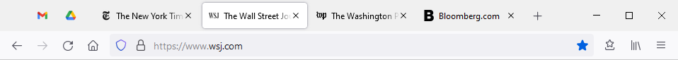
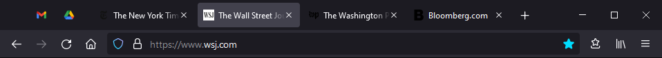
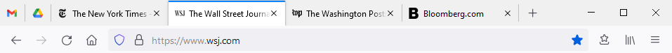
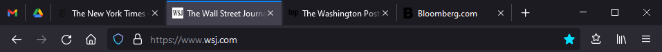

# Positron for Firefox 89+

## Table of Contents

1. [Introduction](#Introduction)
2. [Screenshots](#Screenshots)
3. [Installation](#Installation)
4. [Proton UI Issues](#Proton-UI-Issues)

## Introduction

The [Proton UI](https://wiki.mozilla.org/Firefox/Proton) for Firefox 89 and
later substantially modifies Firefox's User Interface (UI). Although the overall
design is refreshed, tabs have been redesigned to float as buttons and are no
longer connected to the address bar.

The goal of Positron is to make very minimal changes to the Proton UI to resolve
[issues outlined below](#Proton-UI-Issues). In less than 100 lines of CSS,
Positron:

* Restores connected tabs
* Adds visual dividers between inactive tabs
* Restores the small colorful line above the focused tab

Positron does not modify other parts of the Proton UI, including context menus,
theme colors, icons, or UI control positions. Despite font sizes being unchanged,
Positron takes slightly less space vertically and leaves more space for text
horizontally. Positron is also compatible with different Firefox themes and UI
densities. The latest [`userChrome.css`](userChrome.css) supports Firefox 96+. 

## Screenshots

Before (Proton UI):

After (Positron):

## Installation

1. Go to `about:profiles` in the address bar
2. Open the Root Directory for the profile in use
3. Create a `chrome` folder in the root directory
4. Copy the [Positron `userChrome.css`](userChrome.css) into the `chrome` folder
(so that the directory hierarchy is `<root>/chrome/userChrome.css`)
5. Go to `about:config` in the address bar
6. Search the preference names for `legacyUser`
7. Toggle `toolkit.legacyUserProfileCustomizations.stylesheets` and set it to
`true`
8. Restart Firefox

## Proton UI Issues

The new Proton UI tab design with floating tabs creates a more disjointed and
confusing experience compared to the older approach with connected tabs:

* Tab elements are no longer grouped together. For example, the back and forward
buttons control the state of the focused tab, but because they are now
disconnected from that tab, visually they look like they would help the user
navigate between tabs instead. Switching back to connected tabs results in
visually grouping all the controls that are related to the focused tab. This
functionality is apparent to users even before they interact with Firefox for
the first time. This argument is almost verbatim the reason
[why tabs were placed on top](https://www.youtube.com/watch?v=HmgtW2Iw-kE)
in Firefox 4 more than a decade ago.
* The new design removes [visual dividers](https://blog.tubikstudio.com/visual-dividers-user-interface/)
between inactive tabs, which makes it challenging to identify where one inactive
tab ends and the next begins. This results in misclicks and focusing of the
wrong tab, especially as the number of tabs in the tab bar increases.
* Finally, the new design removes almost all color from tabs and the address bar.
It makes Firefox feel cold and sterile, and results in background and foreground
colors not having [sufficient contrast ratio](https://www.w3.org/TR/WCAG21/#non-text-contrast).
The contrast ratio between active and inactive tabs is 1.13:1, which is below
the recommended minimum of 3:1 for non-text elements. Low contrast interfaces
can make it difficult for many users to use. A smidge of color can make all the
difference and add a bit of playfulness.
